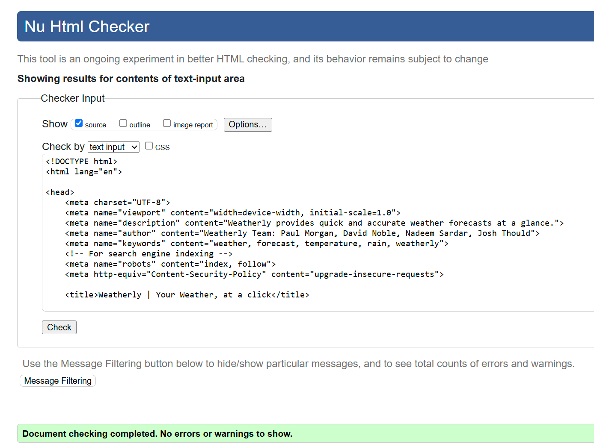

# Weatherly

Team Hackathon CI Weather App Project

Authors: Paul Morgan, David Noble, Nadeem Sardar, Josh Thould

## Description

Weatherly is an easy to use weather app that provides the user with current and future weather information for locations around the globe. The site utilises the
openweathermap API to provide useful data for a location provided by the user.

## Features

The sites header section features a text box for user input. There is also the option to press the "Get my location" button which populates the text input box with the user's current location. The submit button runs the javascript to generate the various weather cards.

A card featuring the current weather using data from Openweathermap's "Current Weather Data" API is shown upon submitting a location.

Beneath the current weather is a 5 day forecast using data from Openweathermap's "5 Day / 3 Hour Forecast" API.

Each of the 5 day forecast cards can be clicked to show a modal with the day split into 3 hour segments, each shown on a seperate card.

## Deployment Procedure

The site will be deployed using GitHub Pages using the following steps.

- Visit GitHub.
- Navigate to the [Weatherly](https://kernowpablouk.github.io/Weatherly/) repository.
- Click settings along the top options bar.
- Click pages on the left hand side menu bar.
- Under Build & Deployment section, click the dropdown button under 'Branch' that is labelled 'None' and select "Main".
- Click Save.
- After a short time, refresh the page and at the top of the page a new box will appear stating 'Your site is live at...'
- Click 'Visit site' button to open the newly deployed site in a new window

## How to View the Project

- [View the deployed website](https://kernowpablouk.github.io/Weatherly/)

## AI Usage Within the Project

AI was used to explain a number of bugs throughout the process of creating the site. Sometimes the suggested code was implemented, other times a mistype or error was shown,
allowing for manual correction. This sped up the process of debugging greatly and allowed for more time implementing features.

Copilot was also used to generate the code for media queries to alter the display of the weather cards from horizontal to vertical. This made an otherwise laborious process
quick and easy.

All of the images used were generated using Microsoft Copilot, including all the the individual weather icons and the background placeholder image.

Copilot was also used to review working code in Javascript for refactoring, but each suggestion was reviewed and although some gave cleaner code, the outcome was not always successful and required in depth studying and testing, a lot of the suggestions looked nice, but were not functional and broke so were not implemented.

## Documents

### Wireframes

[Mobile Wireframes](assets/images/readme/weatherly-mobile-wireframes.png)

[Desktop Wireframes](assets/images/readme/weatherly-desktop-wireframe.png)

### Colours & Typography

#### Colours

//TODO - requires image of palette and why we chose these colours

#### Typography

//TODO - requires screenshot of google fonts chosen and reasoning

### Testing & Validation

#### Code Validation

All HTML and CSS code was validated using the W3C Markup Validation Service and W3C CSS Validation Service, respectively. The results are as follows:

### Initial HTML Verification index.html

Nine errors were found in the HTML code and corrected by line validation. All elements are properly nested and closed, ensuring a well-structured document.

## After Debugging

### CSS Verification of styles.css

#### Lighthouse tests

Lighthouse tests initially were decent but an issue in best practices needing resolution was required due to the image source used as a placeholder.

After this was corrected we achieved 100% across the board for all lighthouse scores.

#### WAVE accessibility tests

Wave test results initially came back with a few warnings and an error on semantics, but these were easily resolved without affect to the look or operation of the site.

### Webpage preview

Homepage

Desktop View of the forecast page

Mobile/Tablet View of the forecast page

The 3 Hourly Forecast Modal

### Future Features

Here's a glimpse of what future releases of Weatherly would look like:

- A feature where users can switch between saved locations in on click/tap
- A feature which will display moonrise and moonset based on location, with the relevant moon phase icons
- A dynamic background image/animcation that changes based on the weather conditions
- Currently Weatherly has a link to the Met Office to provide weather warnings, future releases would ideally include a standalone Weatherly Weather alerts feature
- Using the OpenWeather API we were limited to a 5 day weekly forecast and a 3 hour daily forecast, in a future
release we would look to source more accurate data so we could provide more detailed and accurate updates.
- We would also like to implement the ability to find your location using postcode, utilising a postcode finder api that would complete the address for more accurate weather forecasting when the user is manually entering a location, instead of geolocation.
- Finally, once the above features were implemented, creating a Weatherly App would be the long term goal.

### Credits

- [Open Weather](https://openweathermap.org/api) for the 5 day / 3 Hour Forecast API and the Current Weather API and for making them free!
- [Google Fonts](https://fonts.google.com/) for typography.
- [Coolors.co](https://coolors.co/) for palette selection.
- [Font Awesome](https://fontawesome.com/) for icons used within the website.
- [Favicon.io](https://favicon.io/) for converting logo image to favicon.
- [Stack Overflow](https://stackoverflow.com/) for random problem solving/syntax remembrance.
- [Microsoft Copilot](https://copilot.microsoft.com/) for image generation code assistance and code review.
- [Bootstrap](https://getbootstrap.com/) for the framework to be built upon.
- [Am I Responsive](https://ui.dev/amiresponsive) for the multi device image on this README.
- [Roo MacArthur](https://github.com/roomacarthur) for his help on directing our finding of a solution on a large issue     towards event listeners that enabled us to then find the issue correctly and implement the fix independantly.
